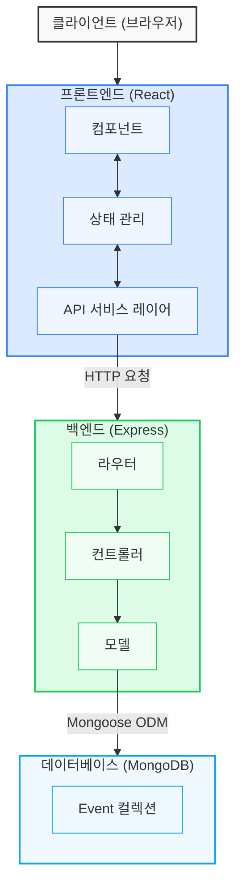

# 심플 캘린더 (Simple Calendar)

월별 캘린더 기반의 간편한 일정 관리 웹 애플리케이션입니다. React.js와 TypeScript로 구현된 프론트엔드, Node.js와 Express.js로 구현된 백엔드, 그리고 MongoDB를 데이터베이스로 사용하는 풀스택 프로젝트입니다.

## 주요 기능

- 월간 캘린더 보기 (월별 이동 기능)
- 일정 생성, 조회, 수정, 삭제 기능
- 날짜별 일정 표시 및 요약 보기
- 일정 상세 보기 및 관리
- 반응형 디자인 (모바일, 태블릿, 데스크톱 지원)

## 기술 스택

### 프론트엔드

- React.js (v18.2)
- TypeScript
- Tailwind CSS (v3.3)
- React Router DOM (v6.22)
- Axios
- date-fns (날짜 관리)

### 백엔드

- Node.js (v18+)
- Express.js
- TypeScript
- MongoDB & Mongoose
- RESTful API
- 표준화된 API 응답 처리

### 개발 및 배포 환경

- Docker & Docker Compose
- Nginx (프로덕션 환경)

## 설치 및 실행 방법

### 사전 요구사항

- Docker 및 Docker Compose 설치
- Node.js 18 이상 및 npm 설치 (로컬 개발 시)

### 환경 변수 설정

프로젝트는 환경 변수를 통해 설정할 수 있습니다. `.env.example` 파일을 참고하여 필요한 환경 변수를 설정하세요.

1. 개발 환경용 환경 변수 설정

```bash
# .env.development 파일 생성 또는 수정
cp .env.example .env.development
# 필요한 설정 수정
```

2. 프로덕션 환경용 환경 변수 설정

```bash
# .env.production 파일 생성 또는 수정
cp .env.example .env.production
# 필요한 설정 수정 (특히 보안 관련 설정)
```

**주요 환경 변수**:

- `PORT`: 백엔드 서버 포트 (기본값: 5000)
- `BACKEND_PORT`: 호스트에서 백엔드에 접근할 포트 (기본값: 5001, 개발환경)
- `FRONTEND_PORT`: 프로덕션 환경에서 프론트엔드에 접근할 포트 (기본값: 80)
- `MONGO_USERNAME` / `MONGO_PASSWORD`: MongoDB 인증 정보 (프로덕션 환경)
- `REACT_APP_API_URL`: 프론트엔드에서 백엔드 API에 접근할 URL

### Docker를 사용한 실행 (권장)

1. 저장소 클론

```bash
git clone https://github.com/yourusername/my-service.git
cd my-service
```

2. 개발 환경에서 실행

```bash
docker-compose up
```

3. 프로덕션 환경에서 실행

```bash
docker-compose -f docker-compose.prod.yml up
```

4. 환경 변수를 변경하여 포트 충돌 해결 (필요시)

```bash
# .env.development 파일에서 포트 변경
BACKEND_PORT=5002  # 다른 포트로 변경

# 변경된 설정으로 실행
docker-compose up
```

### 로컬 개발 환경에서 개별 실행

1. 프론트엔드 실행

```bash
cd my-webapp
npm install
npm start
```

2. 백엔드 실행

```bash
cd my-server
npm install
npm run dev
```

3. MongoDB 실행 (별도로 설치 필요)

```bash
mongod --dbpath /your/data/path
```

## 폴더 구조

```
my-service/
├── .docker/                # Docker 관련 설정 파일
│   └── nginx.conf          # Nginx 설정
├── my-webapp/              # 프론트엔드 애플리케이션
│   ├── public/             # 정적 파일
│   ├── src/                # 소스 코드
│   │   ├── components/     # 리액트 컴포넌트
│   │   ├── pages/          # 페이지 컴포넌트
│   │   ├── services/       # API 서비스
│   │   └── utils/          # 유틸리티 함수
│   ├── Dockerfile          # 프론트엔드 Docker 설정
│   └── package.json        # 프론트엔드 의존성
├── my-server/              # 백엔드 애플리케이션
│   ├── src/                # 소스 코드
│   │   ├── config/         # 설정 파일
│   │   ├── controllers/    # 컨트롤러
│   │   ├── models/         # 데이터베이스 모델
│   │   ├── routes/         # API 라우트
│   │   ├── middleware/     # 미들웨어
│   │   ├── app.ts          # Express 앱 설정
│   │   └── index.ts        # 진입점
│   ├── Dockerfile          # 백엔드 Docker 설정
│   └── package.json        # 백엔드 의존성
├── docker-compose.yml      # 개발용 Docker Compose 설정
├── docker-compose.prod.yml # 프로덕션용 Docker Compose 설정
└── README.md               # 프로젝트 문서
```

## 아키텍처



이 프로젝트는 3계층 아키텍처로 구성되어 있습니다:

1. **프론트엔드 (클라이언트)**

   - React.js로 구현된 SPA (Single Page Application)
   - RESTful API를 통해 백엔드와 통신
   - 상태 관리 및 API 요청 처리를 위한 커스텀 훅 사용

2. **백엔드 (서버)**

   - Express.js 기반의 RESTful API
   - 비즈니스 로직 처리 및 데이터베이스 액세스
   - 컨트롤러-라우터-모델 구조로 관심사 분리
   - 표준화된 API 응답 형식과 오류 처리
   - 환경 변수 기반 구성으로 유연한 배포 지원

3. **데이터베이스**
   - MongoDB (NoSQL 데이터베이스)
   - Mongoose ODM을 사용한 데이터 모델링 및 유효성 검증

### API 엔드포인트

- `GET /api/events?month=<month>&year=<year>` - 특정 월의 일정 조회
- `GET /api/events/:id` - 특정 일정 상세 조회
- `POST /api/events` - 새 일정 생성
- `PUT /api/events/:id` - 기존 일정 수정
- `DELETE /api/events/:id` - 일정 삭제

### API 응답 형식

모든 API 응답은 다음과 같은 표준화된 형식을 따릅니다:

#### 성공 응답

```json
{
  "success": true,
  "data": { ... },  // 응답 데이터
  "count": 10       // 데이터가 배열인 경우 항목 수 (선택 사항)
}
```

#### 오류 응답

```json
{
  "success": false,
  "error": "오류 메시지" // 문자열 또는 문자열 배열
}
```

HTTP 상태 코드:
- 200: 성공적인 요청
- 201: 리소스 생성 성공
- 400: 잘못된 요청 (클라이언트 오류)
- 404: 리소스를 찾을 수 없음
- 500: 서버 오류

## 라이선스

ISC 라이선스에 따라 배포됩니다. 자세한 내용은 LICENSE 파일을 참조하세요.
